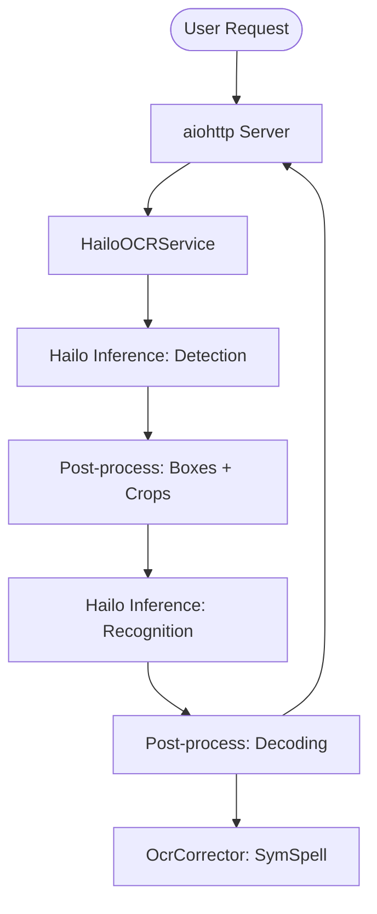

# Hailo-10H OCR Service Architecture

## Purpose
Deploy NPU-accelerated OCR (text detection and recognition) as a managed systemd service on Raspberry Pi 5 + Hailo-10H, using optimized HEF models for maximum throughput.

## Design Philosophy
- **Modular Infrastructure:** Leverages `hailo-apps` for core inference logic and pre/post-processing.
- **NPU-First:** Both text detection and recognition stages are offloaded to the Hailo-10H NPU.
- **Async Execution:** Bridge NPU asynchronous callbacks to Python `asyncio` for non-blocking HTTP processing.
- **Isolation:** Dedicated user, group, and virtual environment (`/opt/hailo-ocr/venv`).

## Components

### 1. Processing Pipeline
1. **Preprocessing:** Image decoded and resized to detection model input size (typically 640x640).
2. **Text Detection:** Runs on NPU. Returns a heatmap.
3. **Region Extraction:** Heatmap processed via `det_postprocess` (DB post-processing) to find bounding boxes.
4. **Recognition Batching:** Crops are resized with padding (typically 320x48) and batched (batch size 8) for the NPU.
5. **Text Recognition:** Batched recognition on NPU. Returns character probabilities.
6. **Decoding:** CTCCreedy decoder converts probabilities to text.
7. **Correction:** Optional spell correction using SymSpell dictionary.

### 2. Deployment Model
- **Venv Isolation:** `/opt/hailo-ocr/venv` contains all dependencies including `hailo-apps`.
- **Vendoring:** `hailo-apps` is vendored to `/opt/hailo-ocr/vendor` and patched to use `/var/lib/hailo-ocr/resources` for model resolution.
- **Resource Management:**
  - HEF models are downloaded during installation from Hailo S3.
  - C++ post-process libraries are fetched and linked.
  - Dictionary files for spell correction are bundled or downloaded.

### 3. Resource Budget
- **NPU Memory:** ~1.5 GB for detection + recognition HEFs.
- **System Memory:** ~2.0 GB (Python, OpenCV, Cache).
- **CPU Usage:** ~50% on Pi 5 during active inference (mostly OpenCV and decoding logic).

## Model Resolution
The service resolves HEF models in the following order:
1. Path specified in `config.yaml`.
2. `/var/lib/hailo-ocr/resources/models/hailo10h/`.
3. Vendored `hailo-apps` local resources.

## Performance Characteristics
- **Batch Size:** Recognition uses batch size 8 to saturate NPU throughput.
- **Concurrency:** Multiple requests can be handled concurrently, with NPU access managed by the HailoRT scheduler.
- **Warmup:** Models can be pre-loaded at startup to eliminate the 5-10s cold-start penalty.

## Integration
- **HailoRT:** Uses `hailo_platform` via `HailoInfer` wrapper.
- **Systemd:** Managed as `hailo-ocr.service`, logging to `journald`.
